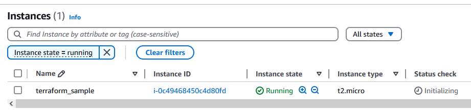

## aws_proj (Creating an EC2 instance using terraform)

### clone this repository of aws_proj
### with the main.tf file present do a 'terraform init' so that it will be ready.
```
aws_proj/local_state# terraform init                         
Initializing the backend...
Initializing provider plugins...
- Finding hashicorp/aws versions matching "~> 4.16"...
- Installing hashicorp/aws v4.67.0...
- Installed hashicorp/aws v4.67.0 (signed by HashiCorp)
...

Terraform has been successfully initialized!
```

### 'constant values' will remain constant throughout, but according to your ami and instance_type, change those value and then perform 'terrafrom plan'

```
aws_proj/local_state# terraform plan

Terraform used the selected providers to generate the following execution plan. Resource actions are
indicated with the following symbols:
  + create

Terraform will perform the following actions:

  # aws_instance.app_server will be created
```

### Then do 'terraform apply' and the EC2 instance will be created successfully

```
aws_proj/local_state# terraform apply

Terraform used the selected providers to generate the following execution plan. Resource actions are
indicated with the following symbols:
  + create

Do you want to perform these actions?
  Terraform will perform the actions described above.
  Only 'yes' will be accepted to approve.

  Enter a value: yes

aws_instance.app_server: Creating...
aws_instance.app_server: Still creating... [10s elapsed]
aws_instance.app_server: Creation complete after 17s

Apply complete! Resources: 1 added, 0 changed, 0 destroyed.
```
